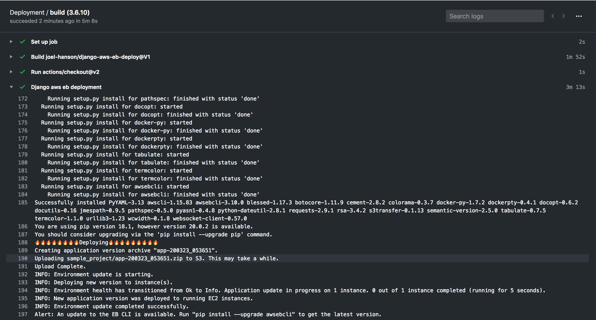

<p align="center">
  <a href="https://github.com/marketplace/actions/elastic-beanstalk-django-deployment-action">
    
  </a>
</p>

<h1 align="center">
  Github action for deploying the Django project to Elastic beanstalk.
</h1>

<div align="center">

</div>
<p align="center">
  This <a href="https://github.com/features/actions">GitHub Action</a> will deploy your Django project to <a href="https://aws.amazon.com/elasticbeanstalk/">AWS Elastic beanstalk</a>. It can be configured to upload your production-ready code into any branch you'd like, and even make multiple deployments it to different environments like staging or uat environments. You can also run linting, testing and security checks before deploying. And also you can download the reports of the coverage and the security checks as artifacts.
</p>

This action has the following features:
- Deploy Django project to elasticbeanstalk.
- Run unit tests.
- Download coverage reports.
- Run security checks using bandit.
- Download security checks report.
- Run linting using flake8.


<p align="center">
  
</p>

## Usage

It is **important** to have the Elastic beanstalk `config.yml` of your project with its AWS credentials. 

```yml
    - name: Django aws eb deployment
      uses: joel-hanson/django-aws-eb-deploy@V1
      with:
        python_version: ${{ matrix.python_version }}
        flake8: true
        aws_access_key_id: ${{ secrets.aws_access_key_id }}
        aws_secret_access_key: ${{ secrets.aws_secret_access_key }}
        django_path: sample_project
        unit_testing: true
        deploy: true
        min_coverage: 10
        postgresql_required: true
        security_check: true
        flake8_config_file: "sample_project/.flake8"
```


### Getting Started :airplane:

You can include the action in your workflow to trigger on any event that [GitHub actions supports](https://help.github.com/en/articles/events-that-trigger-workflows). If the remote branch that you wish to deploy to doesn't already exist the action will create it for you. Your workflow will also need to include the `actions/checkout` step before this workflow runs in order for the deployment to work.


#### Example

You can view an example of this below.

```yml
name: Build and Deployment

on: push

jobs:
  build:
    runs-on: ubuntu-latest
    strategy:
      matrix:
        python_version: [3.6.10]
        # python_version: [3.5.7, 3.6.10, 3.7.5, 3.8.2]

    steps:
    - uses: actions/checkout@v2
    - name: Django aws eb deployment
      uses: joel-hanson/django-aws-eb-deploy@V1
      with:
        python_version: ${{ matrix.python_version }}
        flake8: true
        aws_access_key_id: ${{ secrets.aws_access_key_id }}
        aws_secret_access_key: ${{ secrets.aws_secret_access_key }}
        django_path: sample_project
        unit_testing: true
        deploy: true
        min_coverage: 10
        postgresql_required: true
        security_check: true
        flake8_config_file: "sample_project/.flake8"

```

If you'd like to make it so the workflow only triggers on push events to specific branches then you can modify the `on` section.

```yml
on:
  push:
    branches:
      - master
```

### Configuration 📁

The `with` portion of the workflow **must** be configured before the action will work. You can add these in the `with` section found in the examples above. Any `secrets` must be referenced using the bracket syntax and stored in the GitHub repositories `Settings/Secrets` menu. You can learn more about setting environment variables with GitHub actions [here](https://help.github.com/en/articles/workflow-syntax-for-github-actions#jobsjob_idstepsenv).

#### Required Setup

One of the following deployment options must be configured.

| Key            | Value Information                                                                                                                                                                                                                                                                                                                                                                                                                                              | Type             | Required |
| -------------- | -------------------------------------------------------------------------------------------------------------------------------------------------------------------------------------------------------------------------------------------------------------------------------------------------------------------------------------------------------------------------------------------------------------------------------------------------------------- | ---------------- | -------- |
| `AWS_ACCESS_KEY_ID`          | You should enter the AWS access key if ID. if you don't have one please [learn more about how to generate one here](https://docs.aws.amazon.com/general/latest/gr/aws-sec-cred-types.html#access-keys-and-secret-access-keys) **This should be stored as a secret**.'                                                                                                                           | `secrets`           | **Yes**  |
| `AWS_SECRET_ACCESS_KEY` | The AWS secret access key. **This should be stored as a secret**.                                                                                                 | `secrets` | **Yes**  |

In addition to the deployment options you must also configure the following.

| Key                | Value Information                                                                                                                                                                                                                                                                                                                                     | Type   | Required | Default |
| ------------------ | ----------------------------------------------------------------------------------------------------------------------------------------------------------------------------------------------------------------------------------------------------------------------------------------------------------------------------------------------------- | ------ | -------- | -------- |
| `FLASK8` | This boolean flag to whether to run flake8 linting for our project.                                                                                                                                                                                   | `with` | **No**  | false  |
| `PYTHON_VERSION` | Version range or exact version of a Python version to use, using SemVer's version range syntax. | `with` | **Yes**  | 3.6.10  |
| `FLAKE8_CONFIG_FILE` | The flake8 config path relative to the github repository (this requires input flake8 to be true). | `with` | **No**  | ".flake8"  |
| `DEPLOY` | Deploy to AWS Elastic beanstalk. | `with` | **Yes**  | true  |

#### Optional Choices

| Key                | Value Information                                                                                                                                                                                                                                                                                                                                     | Type   | Required | Default |
| ------------------ | ----------------------------------------------------------------------------------------------------------------------------------------------------------------------------------------------------------------------------------------------------------------------------------------------------------------------------------------------------- | ------ | -------- | -------- |
| `DJANGO_PATH` | This is the path at which the your django project is located in you github repo. | `with` | **No**  | "."  |
| `UNIT_TESTING` | Whether to run unit tests. | `with` | **No**  | false  |
| `MIN_COVERAGE` | Minimum code coverage required. | `with` | **No**  | 0  |
| `POSTGRESQL_REQUIRED` | Run unit tests with postgresql. | `with` | **No**  | false  |
| `SECURITY_CHECK` | Security oriented static analyser for python code using bandit. | `with` | **No**  | false  |
| `FLAKE8_CONFIG_FILE` | The flake8 config path relative to the github repository (this requires input flake8 to be true). | `with` | **No**  | true  |

With the action correctly configured you should see the workflow trigger the deployment under the configured conditions.

---

### Operating System Support 💿

This action is primarily developed using [Ubuntu](https://ubuntu.com/). [In your workflow job configuration](https://help.github.com/en/actions/automating-your-workflow-with-github-actions/workflow-syntax-for-github-actions#jobsjob_idruns-on) it's recommended to set the `runs-on` property to `ubuntu-latest`.

```yml
jobs:
  build-and-deploy:
    runs-on: ubuntu-latest
```
---
### Artifacts 📁

You can get the report for the coverage and the bandit security checks reports for you django project. [learn more about artifacts](https://help.github.com/en/actions/configuring-and-managing-workflows/persisting-workflow-data-using-artifacts).

#### Bandit report (security checks report) 👮‍♂️

The following is an bandit report for a django project. [learn more about bandit](https://pypi.org/project/bandit/).

```txt
Run started:2020-03-22 18:12:42.386731

Test results:
>> Issue: [B105:hardcoded_password_string] Possible hardcoded password: '(2h1-*yec9^6xz6y920vco%zdd+!7m6j6$!gi@)3amkbduup%d'
   Severity: Low   Confidence: Medium
   Location: ./sample_project/settings.py:25
   More Info: https://bandit.readthedocs.io/en/latest/plugins/b105_hardcoded_password_string.html
24      # SECURITY WARNING: keep the secret key used in production secret!
25      SECRET_KEY = "(2h1-*yec9^6xz6y920vco%zdd+!7m6j6$!gi@)3amkbduup%d"
26
27      # SECURITY WARNING: don't run with debug turned on in production!
28      DEBUG = True

--------------------------------------------------

Test results:
	No issues identified.

Code scanned:
	Total lines of code: 138
	Total lines skipped (#nosec): 0

Run metrics:
	Total issues (by severity):
		Undefined: 0.0
		Low: 0.0
		Medium: 0.0
		High: 0.0
	Total issues (by confidence):
		Undefined: 0.0
		Low: 0.0
		Medium: 0.0
		High: 0.0
Files skipped (0):
```
This can be achieved by add the following to your job

```yml
    - name: Security check report artifacts
      uses: actions/upload-artifact@v1
      if: failure()
      with:
        name: bandit
        path: output/security_report.txt
```


#### Coverage report 👮‍♂️

The following is an example coverage report done for a sample django project by running unit tests. [learn more about coverage](https://coverage.readthedocs.io/en/coverage-5.0.4/)


```txt
Name                                Stmts   Miss  Cover
-------------------------------------------------------
manage.py                              12      2    83%
sample_app/__init__.py                  0      0   100%
sample_app/admin.py                     1      1     0%
sample_app/apps.py                      3      3     0%
sample_app/migrations/__init__.py       0      0   100%
sample_app/models.py                    1      1     0%
sample_app/tests.py                     1      0   100%
sample_app/views.py                     1      1     0%
sample_project/__init__.py              0      0   100%
sample_project/asgi.py                  4      4     0%
sample_project/settings.py             18      0   100%
sample_project/urls.py                  3      0   100%
sample_project/wsgi.py                  4      4     0%
-------------------------------------------------------
TOTAL                                  48     16    67%

```
This can be achieved by add the following to your job

```yml
    - name: Coverage report artifacts
      uses: actions/upload-artifact@v1
      if: failure()
      with:
        name: coverage report
        path: output/coverage_report.txt

    - name: Coverage report artifacts if failed
      uses: actions/upload-artifact@v1
      if: failure()
      with:
        name: coverage report if failed
        path: output/coverage_report.txt
```

The following is the full workflow file that you can use:

```yml
name: Deployment

on:
  push:
    branches:
      - master
jobs:
  build:
    runs-on: ubuntu-latest
    strategy:
      matrix:
        python_version: [3.6.10]
        # python_version: [3.5.7, 3.6.10, 3.7.5, 3.8.2]

    steps:
    - uses: actions/checkout@v2
    - name: Django aws eb deployment
      uses: joel-hanson/django-aws-eb-deploy@V1
      with:
        python_version: ${{ matrix.python_version }}
        flake8: true
        aws_access_key_id: ${{ secrets.aws_access_key_id }}
        aws_secret_access_key: ${{ secrets.aws_secret_access_key }}
        django_path: sample_project
        unit_testing: true
        deploy: true
        min_coverage: 10
        postgresql_required: true
        security_check: true
        flake8_config_file: "sample_project/.flake8"

    - name: Coverage report artifacts
      uses: actions/upload-artifact@v1
      if: failure()
      with:
        name: coverage report
        path: output/coverage_report.txt

    - name: Coverage report artifacts if failed
      uses: actions/upload-artifact@v1
      if: failure()
      with:
        name: coverage report if failed
        path: output/coverage_report.txt

    - name: Security check report artifacts
      uses: actions/upload-artifact@v1
      if: failure()
      with:
        name: bandit
        path: output/security_report.txt
```

---

### License 👨🏻‍💻

The Dockerfile and associated scripts and documentation in this project are released under the [MIT License](LICENSE).

Container images built with this project include third party materials. As with all Docker images, these likely also contain other software which may be under other licenses. It is the image user's responsibility to ensure that any use of this image complies with any relevant licenses for all software contained within.
